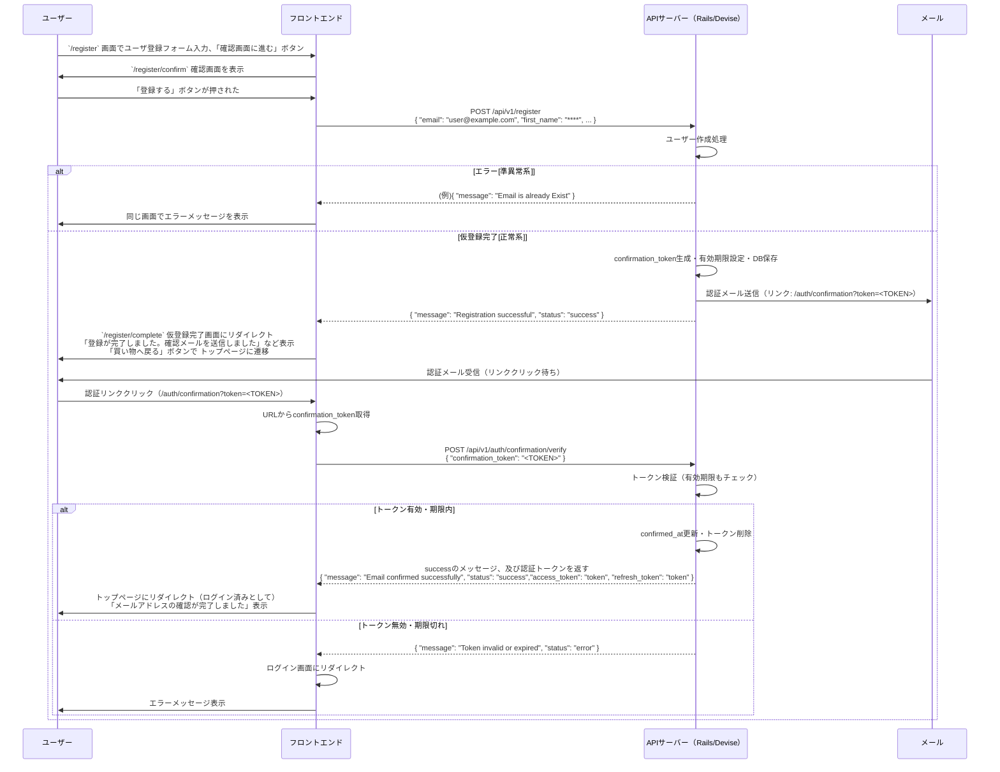
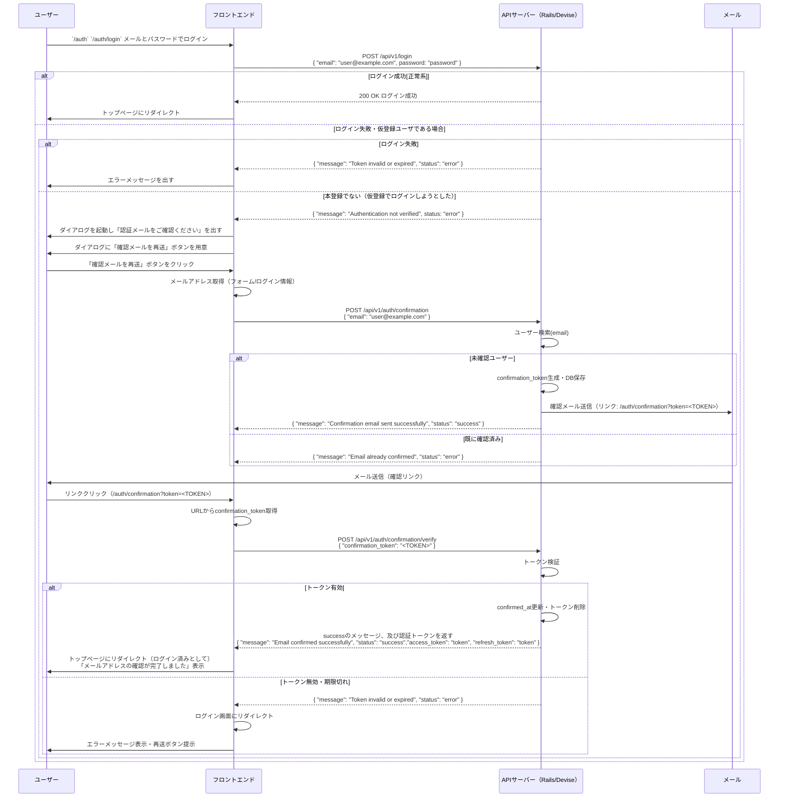
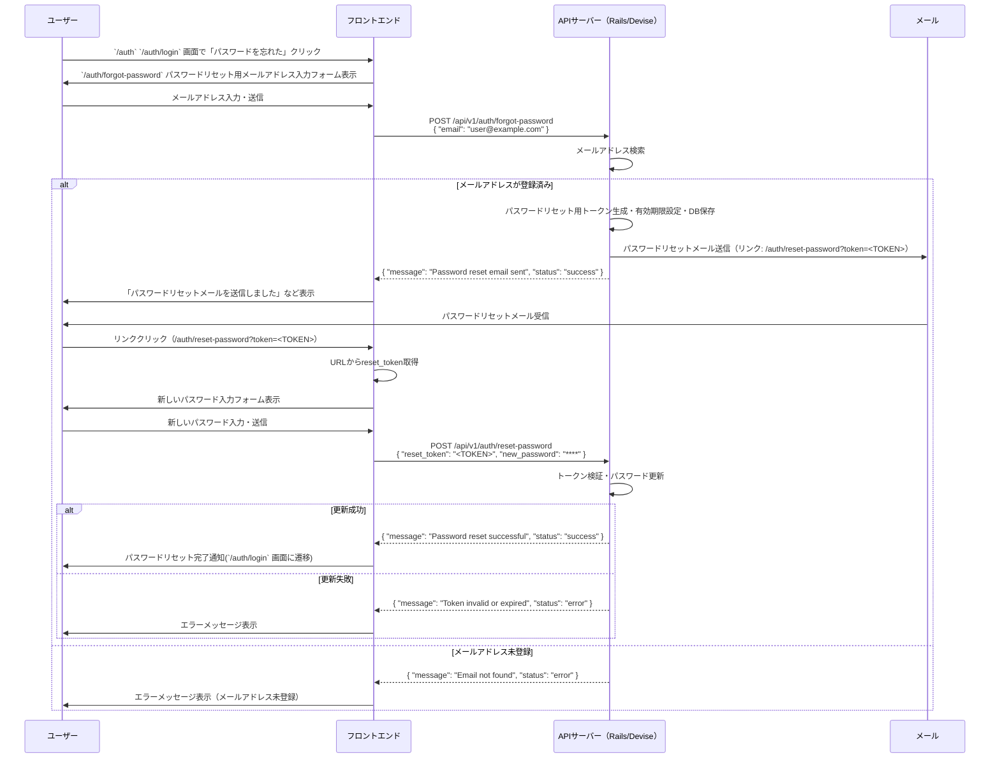

# 認証フロー

## ユーザ登録 → ユーザ仮登録 → 本登録のフロー

### フロントエンド URL

- `/register` 新規会員登録 情報入力
- `/register/confirm` 新規会員登録 情報確認
- `/register/complete` 新規会員登録 登録完了
- `/auth/confirmation?token=<TOKEN>` 認証メールに記載の URL

### バックエンド URL

- POST `/api/v1/register` ユーザ登録
- POST `/api/v1/auth/confirmation/verify` 本認証

## ログイン

### フロントエンド URL

- `/auth` `/auth/login` ログイン画面
- `/auth/confirmation?token=<TOKEN>` 認証メールに記載の URL

### バックエンド URL

- POST `/api/v1/login` ログイン
- POST `/api/v1/auth/confirmation` 認証 URL 再送信
- POST `/api/v1/auth/confirmation/verify` 本認証

## パスワードを忘れた場合のフロー

### フロントエンド URL

- `/auth` `/auth/login` ログイン画面
- `/auth/forgot-password` パスワードリセット用メールアドレス入力フォーム
- `/auth/reset-password?token=<TOKEN>` パスワードリセット画面（パスワードリセットメールで受信）

### バックエンド URL

- POST `/api/v1/login` ログイン
- POST `/api/v1/auth/forgot-password` パスワード初期化リクエスト
- POST `/api/v1/auth/reset-password` リセットパスワード

