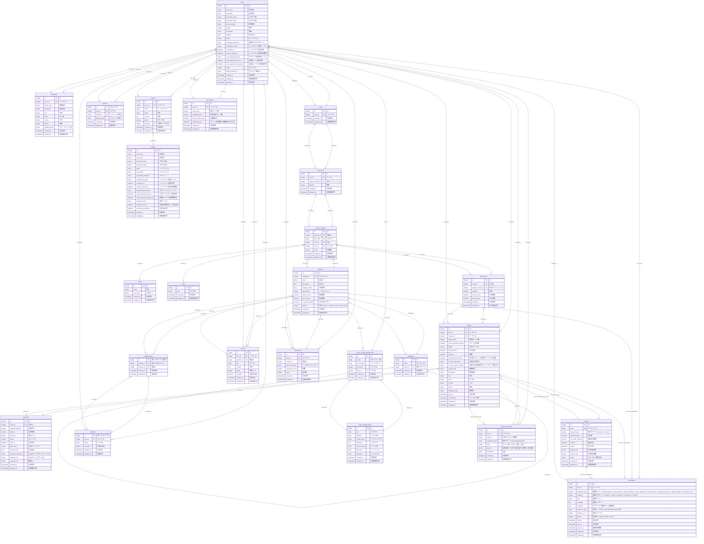

```mermaid
---
config:
  layout: dagre
---
erDiagram
	direction TB
	users {
		integer id PK "ID"  
		string first_name  "氏名(名)"  
		string last_name  "氏名(姓)"  
		string first_name_kana  "カタカナ(名)"  
		string last_name_kana  "カタカナ(姓)"  
		string phone_number  "携帯番号"  
		integer gender  "性別"  
		string occupation  "職業"  
		date birthday  "生年月日"  
		string email  "メールアドレス"  
		string encrypted_password  "暗号化されたパスワード"  
		string confirmation_token  "メールアドレス認証トークン"  
		datetime confirmed_at  "メールアドレス認証日時"  
		datetime confirm_expired_at  "メールアドレス認証有効期限"  
		string reset_password_token  "パスワード再設定用トークン"  
		datetime reset_password_sent_at  "再設定メール送信日時"  
		datetime reset_password_expired_at  "再設定トークン有効期限日時"  
		integer status  "ステータス"  
		string stripe_customer_id  "ストライプ顧客ID"  
		timestamp created_at  "作成日時"  
		timestamp updated_at  "最終更新日時"  
		timestamp deleted_at  "削除日時"  
	}
	addresses {
		integer id PK "ID"  
		integer user_id FK "ユーザーID"  
		string postal_code  "郵便番号"  
		string prefecture  "都道府県"  
		string city  "市区"  
		string town  "町、郡"  
		string chome  "丁目"  
		string banchi  "番地"  
		string building_name  "ビル・マンション名"  
		timestamp created_at  "作成日時"  
		timestamp updated_at  "最終更新日時"  
	}
	categories {
		integer id PK "ID"  
		string name  "カテゴリー名"  
		integer parent_id FK "親カテゴリーID"  
		timestamp created_at  "作成日時"  
		timestamp updated_at  "最終更新日時"  
	}
	products {
		integer id PK "ID"  
		integer category_id FK "カテゴリーID"  
		string name  "商品名"  
		text description  "紹介文"  
		float average_rating  "平均評価"  
		integer total_review  "トータルレビュー"  
		decimal price_exc_tax  "税抜価格"  
		decimal price_inc_tax  "税込価格"  
		boolean is_recommended  "おすすめフラグ"  
		integer gender  "性別, 0: men, 1: women, 2: boy, 3: girl, 4: baby"  
		timestamp created_at  "作成日時"  
		timestamp updated_at  "最終更新日時"  
	}
	product_variants {
		integer id PK "ID"  
		integer product_id FK "商品ID"  
		string sku_code UK "SKUコード"  
		integer color_id FK "色ID"  
		integer size_id FK "サイズID"  
		integer stock  "在庫数"  
		timestamp created_at  "作成日時"  
		timestamp updated_at  "最終更新日時"  
	}
	colors {
		integer id PK "ID"  
		string name  "色名"  
		string hex_code  "16進コード"  
		timestamp created_at  "作成日時"  
		timestamp updated_at  "最終更新日時"  
	}
	sizes {
		integer id PK "ID"  
		string size  "サイズ名"  
		timestamp created_at  "作成日時"  
		timestamp updated_at  "最終更新日時"  
	}
	carts {
		integer id PK "ID"  
		integer user_id FK "ユーザーID"  
		timestamp created_at  "作成日時"  
		timestamp updated_at  "最終更新日時"  
	}
	cart_items {
		integer id PK "ID"  
		integer cart_id FK "カートID"  
		integer product_variant_id FK "商品バリエーションID"  
		integer quantity  "数量"  
		timestamp created_at  "作成日時"  
		timestamp updated_at  "最終更新日時"  
	}
	orders {
		integer id PK "ID"  
		integer user_id FK "ユーザーID"  
		integer coupon_id FK "クーポンID"  
		integer points_used  "使用ポイント数"  
		decimal points_discount_amount  "ポイント割引額"  
		integer status  "注文ステータス"  
		decimal total_amount  "合計金額"  
		decimal total_tax  "税額"  
		decimal total_discount_amount  "割引額（ポイント割引額＋クーポン割引額）"  
		string receiver_full_name  "お届け先の氏名"  
		string receiver_phone_number  "お届け先の携帯番号をハイフンなしで保存する"  
		string postal_code  "郵便番号"  
		string prefecture  "都道府県"  
		string city  "市区"  
		string town  "町、郡"  
		string chome  "丁目"  
		string banchi  "番地"  
		string building_name  "建物名"  
		timestamp paid_at  "支払日時"  
		timestamp canceled_at  "キャンセル日時"  
		timestamp created_at  "作成日時"  
		timestamp updated_at  "最終更新日時"  
	}
	order_items {
		integer id PK "ID"  
		integer order_id FK "注文ID"  
		integer product_variant_id FK "商品バリエーションID"  
		integer quantity  "数量"  
		decimal price_exc_tax  "税抜価格"  
		decimal price_inc_tax  "税込価格"  
		timestamp created_at  "作成日時"  
		timestamp updated_at  "最終更新日時"  
	}
	payments {
		integer id PK "ID"  
		integer order_id FK "注文ID"  
		integer payment_method  "決済方法"  
		decimal amount  "決済金額"  
		string currency  "通貨コード"  
		integer status  "ステータス"  
		datetime paid_at  "決済日時"  
		string error_code  "決済エラーコード"  
		json payment_info  "決済情報"  
		string checkout_session_id  "StripeチェックアウトセッションID"  
		string checkout_url  "StripeチェックアウトURL"  
		string customer_id  "顧客ID"  
		timestamp created_at  "作成日時"  
		timestamp updated_at  "最終更新日時"  
	}
	coupons {
		integer id PK "ID"  
		string code UK "クーポンコード"  
		integer discount_type  "割引タイプ（0: percent, 1: number）"  
		decimal discount_value  "割引値"  
		decimal min_order_amount  "最低注文金額"  
		datetime start_at  "開始日時"  
		datetime end_at  "終了日時"  
		integer usage_limit  "利用制限回数"  
		integer usage_count  "利用済み回数"  
		string status  "ステータス: 無効/有効"  
		timestamp created_at  "作成日時"  
		timestamp updated_at  "最終更新日時"  
	}
	reviews {
		integer id PK "ID"  
		integer user_id FK "ユーザーID"  
		integer product_id FK "商品ID"  
		string title  "タイトル"  
		text content  "内容"  
		integer rating  "評価: 1~5"  
		boolean is_public  "公開/非公開"  
		timestamp created_at  "作成日時"  
		timestamp updated_at  "最終更新日時"  
	}
	favorites {
		integer id PK "お気に入りID"  
		integer user_id FK "ユーザID"  
		integer likeable_id FK "リファレンス対象ID"  
		string likeable_type  "リファレンス対象"  
		timestamp created_at  "作成日時"  
		timestamp updated_at  "更新日時"  
	}
	wishlists {
		integer id PK "欲しいものリストID"  
		integer user_id FK "ユーザーID"  
		string name  "リスト名"  
		boolean is_public  "公開/非公開"  
		timestamp created_at  "作成日時"  
		timestamp updated_at  "更新日時"  
	}
	wishlist_items {
		integer id PK "欲しいものリスト商品ID"  
		integer wishlist_id FK "欲しいものリストID"  
		integer product_id FK "商品ID"  
		timestamp created_at  "作成日時"  
		timestamp updated_at  "更新日時"  
	}
	interactions {
		integer id PK "ID"  
		integer user_id FK "ユーザーID"  
		integer product_id FK "商品ID"  
		string interaction_type  "インタラクションタイプ"  
		integer interaction_count  "回数"  
		double value  "重み値"  
		timestamp created_at  "作成日時"  
		timestamp updated_at  "最終更新日時"  
	}
	inquiries {
		integer id PK "ID"  
		integer user_id FK "ユーザーID"  
		string email  "メールアドレス"  
		string name  "氏名"  
		text content  "内容"  
		integer status  "ステータス"  
		integer admin_id FK "管理者ID（担当者）"  
		timestamp created_at  "作成日時"  
		timestamp updated_at  "最終更新日時"  
	}
	active_storage_attachments {
		integer id PK "ID"  
		string name  "アタッチメント名"  
		string record_type  "レコードタイプ"  
		integer record_id  "レコードID"  
		integer blob_id FK "ブロブID"  
		timestamp created_at  "作成日時"  
		timestamp updated_at  "最終更新日時"  
	}
	active_storage_blobs {
		integer id PK "ID"  
		string key  "ブロブキー"  
		string filename  "ファイル名"  
		string content_type  "コンテンツタイプ"  
		text metadata  "メタデータ"  
		string service_name  "サービス名"  
		bigint byte_size  "バイトサイズ"  
		string checksum  "チェックサム"  
		timestamp created_at  "作成日時"  
		timestamp updated_at  "最終更新日時"  
	}
	user_points {
		integer id PK "ID"  
		integer user_id FK "ユーザーID"  
		integer total_points  "総ポイント数"  
		integer available_points  "利用可能ポイント数"  
		datetime last_purchase_date  "最終購入日"  
		datetime expiration_date  "ポイント有効期限（最終購入日から1年）"  
		timestamp created_at  "作成日時"  
		timestamp updated_at  "最終更新日時"  
	}
	point_transactions {
		integer id PK "ID"  
		integer user_id FK "ユーザーID"  
		integer order_id FK "注文ID（付与・使用時）"  
		string transaction_type  "取引タイプ（earn/use/expire/reset）"  
		integer point  "ポイント数（+付与、-使用・失効）"  
		decimal amount  "関連金額（付与時：購入金額、使用時：割引金額）"  
		string description  "説明"  
		timestamp created_at  "作成日時"  
		timestamp updated_at  "最終更新日時"  
	}
	notifications {
		integer id PK "ID"  
		integer user_id FK "ユーザーID"  
		integer notification_type  "通知タイプ（0: points_earned, 1: points_used, 2: order_confirmed, 3: order_shipped, 4: order_delivered, 5: payment_success, 6: payment_failed, 7: promotion_alert,...）"  
		integer category  "通知カテゴリー（0: points, 1: order, 2: payment, 3: promotion, 4: system）"  
		string title  "通知タイトル"  
		text message  "通知メッセージ"  
		json metadata  "メタデータ（柔軟なデータ格納用）"  
		string reference_type  "参照テーブル名（orders/products/coupons等）"  
		integer reference_id  "参照レコードID"  
		integer priority  "優先度（1:high, 2:medium, 3:low）"  
		timestamp read_at  "既読日時"  
		timestamp sent_at  "送信日時"  
		timestamp expires_at  "通知有効期限"  
		timestamp created_at  "作成日時"  
		timestamp updated_at  "最終更新日時"  
	}
	admins {
		integer id PK "ID"  
		string first_name  "氏名(名)"  
		string last_name  "氏名(姓)"  
		string first_name_kana  "カタカナ(名)"  
		string last_name_kana  "カタカナ(姓)"  
		string email  "メールアドレス"  
		string new_email  "メールアドレス"  
		string encrypted_password  "パスワード"  
		string confirmation_token  "メールアドレス認証トークン"  
		datetime confirmed_at  "メールアドレス認証日時"  
		datetime confirm_expired_at  "メールアドレス認証有効期限"  
		string reset_password_token  "パスワードリセットトークン"  
		datetime reset_password_sent_at  "パスワードリセット送信日時"  
		datetime reset_password_expired_at  "再設定トークン有効期限日時"  
		string invitation_token  "招待トークン"  
		datetime invitation_sent_at  "管理者登録招待メール送信日時"  
		datetime invitation_accepted_at  "招待受諾日時"  
		timestamp created_at  "作成日時"  
		timestamp updated_at  "最終更新日時"  
	}

	users||--||carts:"has one"
	users||--||active_storage_attachments:"has one"
	users||--||user_points:"has one"
	users||--o{orders:"has many"
	users||--o{inquiries:"has many"
	users||--o{reviews:"has many"
	users||--o{addresses:"has many"
	users||--o{interactions:"has many"
	users||--o{favorites:"has many"
	users||--o{wishlists:"has many"
	users||--o{point_transactions:"has many"
	users||--o{notifications:"has many"
	categories||--o{categories:"has many"
	categories||--o{products:"has many"
	products}|--||categories:"belongs to"
	products||--o{product_variants:"has many"
	products||--o{reviews:"has many"
	products||--o{interactions:"has many"
	products||--o{wishlist_items:"has many"
	products||--o{notifications:"may have notifications"
	product_variants}|--||products:"belongs to"
	product_variants}|--||colors:"belongs to"
	product_variants}|--||sizes:"belongs to"
	product_variants||--o{cart_items:"has many"
	product_variants||--o{order_items:"has many"
	carts}|--||users:"belongs to"
	carts||--o{cart_items:"has many"
	cart_items}|--||carts:"belongs to"
	cart_items}|--||product_variants:"belongs to"
	orders}|--||users:"belongs to"
	orders}o--o|coupons:"may use coupon"
	orders||--o{order_items:"has many"
	orders||--||payments:"has one"
	orders||--o{point_transactions:"has many"
	orders||--o{notifications:"may have notifications"
	order_items}|--||orders:"belongs to"
	order_items}|--||product_variants:"belongs to"
	payments}|--||orders:"belongs to"
	coupons||--o{orders:"can be used by many orders"
	coupons||--o{notifications:"may have notifications"
	reviews}|--||users:"belongs to"
	reviews}|--||products:"belongs to"
	interactions}|--||users:"belongs to"
	interactions}|--||products:"belongs to"
	inquiries}|--||users:"belongs to"
	inquiries}|--||admins:"belongs to"
	addresses}|--||users:"belongs to"
	favorites}|--||users:"belongs to"
	wishlists}|--||users:"belongs to"
	wishlists||--o{wishlist_items:"has many"
	wishlist_items}|--||wishlists:"belongs to"
	wishlist_items}|--||products:"belongs to"
	active_storage_attachments}|--||active_storage_blobs:"belongs to"
	active_storage_blobs||--o{active_storage_attachments:"has many"
	products||--o{active_storage_attachments:"has many"
	user_points}|--||users:"belongs to"
	point_transactions}|--||users:"belongs to"
	point_transactions}o--o|orders:"may belong to order"
	notifications}|--||users:"belongs to"
```