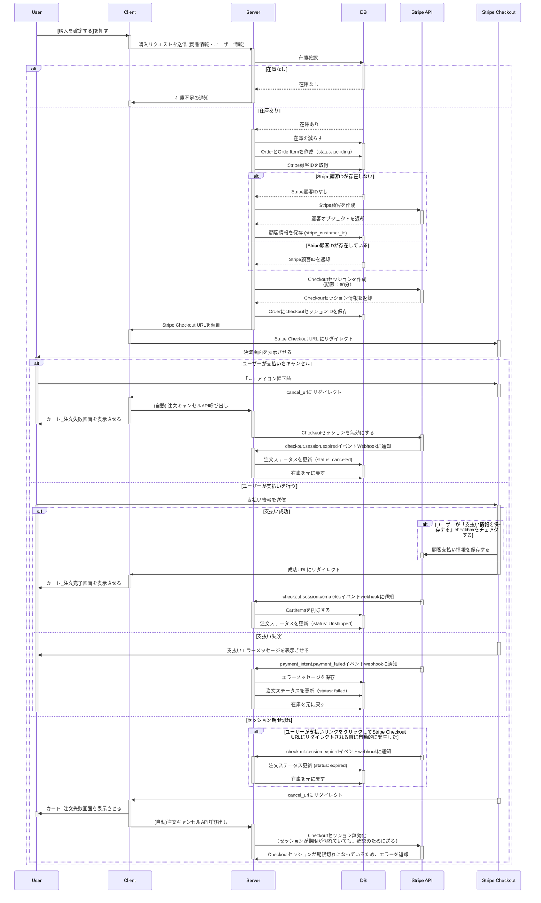

```mermaid
sequenceDiagram
    participant User
    participant Client
    participant Server
    participant DB
    participant Stripe API
    participant Stripe Checkout

    User->>Client: [購入を確定する]を押す;
    activate Client
    Client->>Server: 購入リクエストを送信 (商品情報・ユーザー情報);
    deactivate Client
    activate Server
    Server->>DB: 在庫確認;
    activate DB
    alt 在庫なし
        DB-->>Server: 在庫なし;
        deactivate DB
        Server->>+Client: 在庫不足の通知;
        deactivate Server
        deactivate Client
    else 在庫あり
        DB-->>+Server: 在庫あり;
        Server->>+DB: 在庫を減らす;
        Server->>DB: OrderとOrderItemを作成（status: pending）;
        Server->>DB: Stripe顧客IDを取得;
        deactivate DB
        alt Stripe顧客IDが存在しない
            DB-->>Server: Stripe顧客IDなし;
            activate DB
            deactivate DB
            Server->>+Stripe API: Stripe顧客を作成;
            Stripe API-->>-Server: 顧客オブジェクトを返却;
            Server->>+DB: 顧客情報を保存 (stripe_customer_id);
            deactivate DB
        else Stripe顧客IDが存在している
            DB-->>Server: Stripe顧客IDを返却;
            activate DB
            deactivate DB
        end
        Server->>+Stripe API: Checkoutセッションを作成<br/>（期限：60分）;
        Stripe API-->>-Server: Checkoutセッション情報を返却;
        Server->>+DB: OrderにcheckoutセッションIDを保存;
        deactivate DB
        Server->>-Client: Stripe Checkout URLを返却;
        activate Client
        Client->>+Stripe Checkout: Stripe Checkout URL にリダイレクト;
        deactivate Client
        Stripe Checkout->>-User: 決済画面を表示させる;
        activate User
        alt ユーザーが支払いをキャンセル
            User->>+Stripe Checkout: 「←」アイコン押下時;
            Stripe Checkout->>-Client: cancel_urlにリダイレクト
            activate Client
            Client->>+Server: (自動) 注文キャンセルAPI呼び出し
            Client->>-User: カート_注文失敗画面を表示させる;
            deactivate User
            Server->>Stripe API: Checkoutセッションを無効にする;
            activate Stripe API
            deactivate Server

            Stripe API->>+Server: checkout.session.expiredイベントWebhookに通知;
            deactivate Stripe API
            Server->>+DB: 注文ステータスを更新（status: canceled);
            Server->>DB:在庫を元に戻す;
            deactivate DB
            deactivate Server
        else ユーザーが支払いを行う
            User->>+Stripe Checkout: 支払い情報を送信;
            activate User
            alt 支払い成功
                alt ユーザーが「支払い情報を保存する」checkboxをチェックする
                    Stripe Checkout->>+Stripe API: 顧客支払い情報を保存する;
                    deactivate Stripe API
                end
                Stripe Checkout->>-Client: 成功URLにリダイレクト;
                activate Client
                Client->>User: カート_注文完了画面を表示させる;
                deactivate Client
                Stripe API->>Server: checkout.session.completedイベントwebhookに通知;
                activate Stripe API
                deactivate Stripe API
                activate Server
                Server->>+DB: CartItemsを削除する;
                Server->>DB: 注文ステータスを更新（status: Unshipped）;
                deactivate DB
                deactivate Server
            else 支払い失敗
                activate Stripe Checkout
                Stripe Checkout->>User: 支払いエラーメッセージを表示させる;
                deactivate Stripe Checkout
                Stripe API->>+Server: payment_intent.payment_failedイベントwebhookに通知;
                activate Stripe API
                deactivate Stripe API
                Server->>DB: エラーメッセージを保存;
                activate DB
                Server->>DB: 注文ステータスを更新（status: failed）;
                Server->>-DB: 在庫を元に戻す;
                deactivate DB
            end
            deactivate User
        else セッション期限切れ
            alt ユーザーが支払いリンクをクリックしてStripe Checkout URLにリダイレクトされる前に自動的に発生した
                Stripe API->>+Server: checkout.session.expiredイベントwebhookに通知;
                activate Stripe API
                deactivate Stripe API
                Server->>+DB: 注文ステータス更新 (status: expired)
                Server->>DB: 在庫を元に戻す
                deactivate Server
                deactivate DB
            end
            Stripe Checkout->>+Client: cancel_urlにリダイレクト
            activate Stripe Checkout
            deactivate Stripe Checkout
            Client->>+User: カート_注文失敗画面を表示させる;
            deactivate User
            Client->>+Server: (自動)注文キャンセルAPI呼び出し
            deactivate Client
            Server->>+Stripe API: Checkoutセッション無効化<br/>（セッションが期限が切れていても、確認のために送る）
            Stripe API->>Server: Checkoutセッションが期限切れになっているため、エラーを返却
            deactivate Server
            deactivate Stripe API
        end
    end
```
